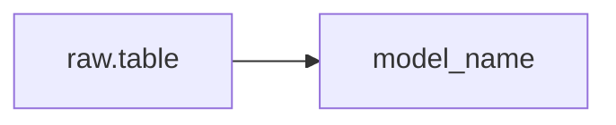

# dbt Compile & Validate

Compiles dbt models to resolve Jinja templates, validates the resulting SQL
against Snowflake, extracts dependency lineage, and diffs compiled output
against previous versions.

Four capabilities, invocable independently or together:
1. **Basic compile** — resolve Jinja, validate ref/source, report errors
2. **Snowflake validation** — EXPLAIN compiled SQL against live warehouse
3. **Compiled SQL diff** — compare current vs. previous compiled output
4. **Lineage extraction** — build dependency graph from compiled SQL

## Inputs

- **Required:** `dbt_project_path` — Path to dbt project root (must contain `dbt_project.yml`)
- **Optional:** `model_selector` — dbt selector expression (default: compile all)
- **Optional:** `--validate-snowflake` — Run EXPLAIN against Snowflake
- **Optional:** `--diff` — Diff compiled SQL against previous snapshot
- **Optional:** `--lineage` — Extract and visualize dependency lineage

## Pre-conditions

- dbt CLI installed (`dbt-core` + `dbt-snowflake` adapter)
- `dbt_project.yml` exists at the specified project path
- For `--validate-snowflake`: active Snowflake connection with SELECT privileges
- For `--diff`: previous compiled output exists in `target/compiled/`

## Workflow

### Step 1: Environment validation

Verify dbt is installed and project is configured:
```bash
which dbt || echo "NOT_FOUND"
dbt --version 2>&1
ls -la {dbt_project_path}/dbt_project.yml
```

If dbt not found: STOP, provide `pip install dbt-core dbt-snowflake`.
If project not found: STOP, confirm path with user.

### Step 2: Resolve compile scope

If `model_selector` provided: use as-is. If single `.sql` path: extract model name. If none: compile all. For INFA2DBT migrations, recommend `+{model_name}` to catch upstream deps.

### Step 3: Execute dbt compile

```bash
cd {dbt_project_path}
dbt compile --select {selector} 2>&1
```

On success (exit 0): read compiled SQL from `target/compiled/`, proceed to Step 4.

On failure: classify errors by type. **Load** references/dbt-compile-errors.md for the error classification lookup table. Distinguish `forward_reference` (expected during migration) from `missing_model` (bug). Report errors with file path, line number, and suggested fix. STOP.

### Step 4: Compile result analysis

For each compiled model, analyze: CTE count, resolved source tables, resolved refs, Informatica artifacts (SETVARIABLE, v_ prefixes, TODOs), and final column count.

### Step 5: SQL validation on Snowflake (when `--validate-snowflake`)

#### ⚠️ HITL CHECKPOINT — 🟡 MEDIUM — Confirm before running SQL

```sql
EXPLAIN {compiled_sql_content};
```

Classify results: success (valid SQL), object not found, column not found, permission denied, or syntax error.

### Step 6: Compiled SQL diff (when `--diff`)

Snapshot `target/compiled/` before first run. On subsequent runs, diff CTE-level changes: CTEs added/removed/modified, column changes, filter changes, source table changes.

### Step 7: Lineage extraction (when `--lineage`)

Parse compiled SQL to build adjacency list and Mermaid diagram:


### Step 8: Generate compile report

JSON report with: run metadata, summary (compiled/failed/warnings counts), per-model analysis, lineage, diffs.

## Output Specification

| File | Location | Format | Description |
|------|----------|--------|-------------|
| `compile_report.json` | `target/` | JSON | Full structured report |
| `compile_summary.md` | `target/` | Markdown | Human-readable summary |
| `lineage_graph.json` | `target/` | JSON | Dependency adjacency list |
| `lineage_diagram.md` | `target/` | Mermaid | Visual dependency graph |

## Error Handling

Errors are classified and handled per type. Common patterns: Jinja syntax → parse error with fix suggestion, missing ref → check if forward reference or bug, missing source → check sources.yml, circular ref → hard stop. **Load** references/dbt-compile-errors.md for full error handling details.

## HITL Checkpoints Summary

| Step | Risk Level | What Requires Approval |
|------|-----------|------------------------|
| Step 5 | 🟡 MEDIUM | Before running EXPLAIN against Snowflake |
